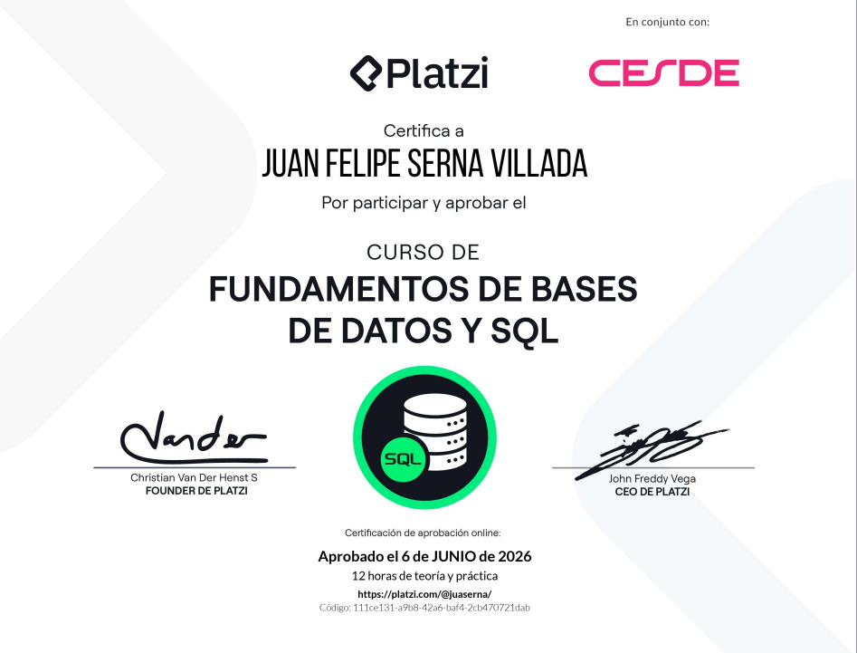
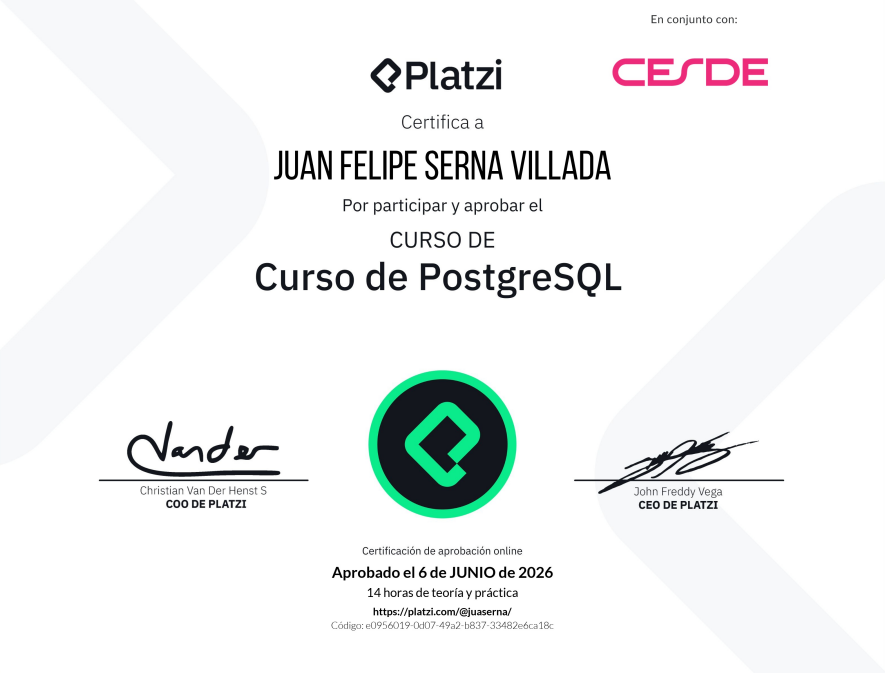
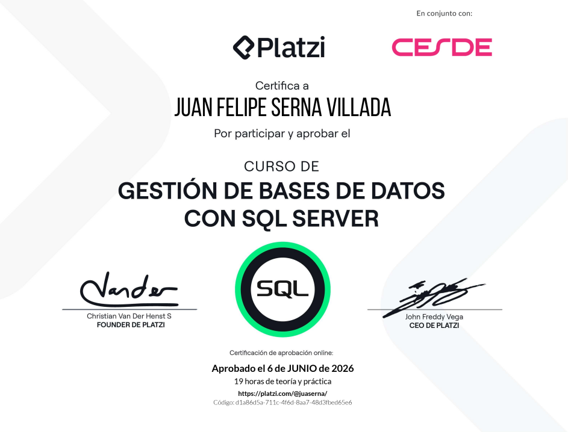
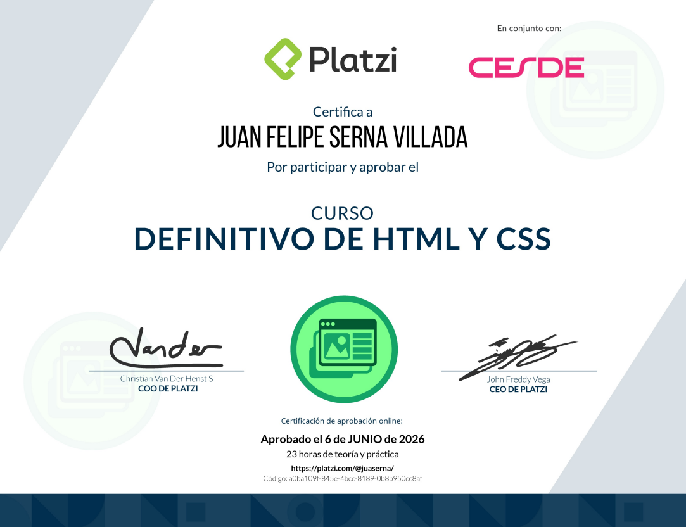
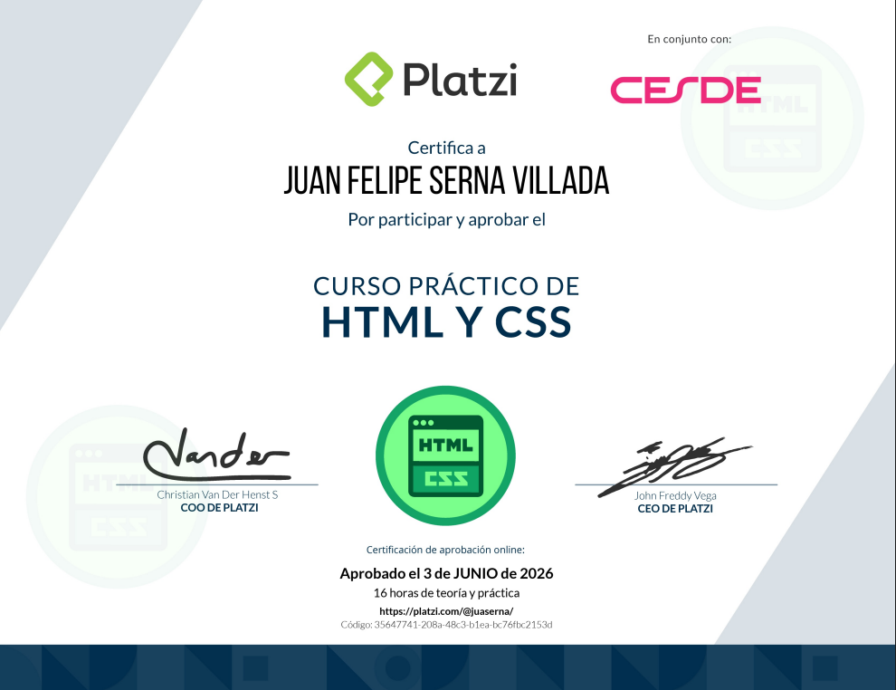

# 📜 Technical Certifications & Continuous Learning

Central repository documenting professional credentials, technical training, and hands-on skill development across **Cybersecurity & Offensive Security**, **Networking Infrastructure**, **Database Management**, and **Web Technologies**.

---

## 🛡️ Cybersecurity & Offensive Security (Primary Focus)

> 🎯 **Featured Target Credentials:** Currently advancing through advanced offensive security tracks and enterprise networking certifications.

| Provider / Certification Track | Core Domains | Current Status |
| :--- | :--- | :--- |
| **Hack The Box (HTB)** | Web Application Penetration Testing, Privilege Escalation, Active Directory Exploitation | 🔄 Active Labs & Writeups |
| **Cisco Security / Networking** | Enterprise Network Defense, Threat Landscape Analysis, Protocol Security | ⏳ Planned |

*(Industry-recognized certifications and HTB badges will be featured here upon completion. Complementary labs and documentation are maintained in the [`/cybersecurity`](./cybersecurity) directory).*

---

## 🌐 Enterprise Networking & Infrastructure

<table>
  <tr>
    <td width="50%" align="center">
      
       
      <b>Computer Networking & Internet Protocols</b>  
      Issued: April 2026  
      <a href="VERIFICATION_URL_HERE">🔗 Verify Credential</a>
    </td>
    <td width="50%" align="center">
      
       
      <b>Advanced Internet Networks (Professional)</b>  
      Issued: April 2026  
      <a href="VERIFICATION_URL_HERE">🔗 Verify Credential</a>
    </td>
  </tr>
</table>

---

## 🗄️ Database Management & Query Engineering

<table>
  <tr>
    <td width="50%" align="center">
      
       
      <b>SQL & Relational Database Fundamentals</b>  
      Issued: June 2026  
      <a href="VERIFICATION_URL_HERE">🔗 Verify Credential</a>
    </td>
    <td width="50%" align="center">
      
       
      <b>PostgreSQL Administration & Querying</b>  
      Issued: June 2026  
      <a href="VERIFICATION_URL_HERE">🔗 Verify Credential</a>
    </td>
  </tr>
  <tr>
    <td width="50%" align="center">
      
       
      <b>Database Management with SQL Server</b>  
      Issued: June 2026  
      <a href="VERIFICATION_URL_HERE">🔗 Verify Credential</a>
    </td>
    <td width="50%" align="center">
      
       
      <b>Logical Thinking & Problem Solving</b>  
      Issued: April 2026  
      <a href="VERIFICATION_URL_HERE">🔗 Verify Credential</a>
    </td>
  </tr>
</table>

---

## 💻 Web Development & Analytical Foundations

<table>
  <tr>
    <td width="50%" align="center">
      
       
      <b>Definitive HTML & CSS Layouts</b>  
      Issued: June 2026  
      <a href="VERIFICATION_URL_HERE">🔗 Verify Credential</a>
    </td>
    <td width="50%" align="center">
      
       
      <b>Practical HTML & CSS Responsive Web Design</b>  
      Issued: June 2026  
      <a href="VERIFICATION_URL_HERE">🔗 Verify Credential</a>
    </td>
  </tr>
</table>

---

## 🛠️ Technical Competencies Overview

- **Cybersecurity & Red Teaming:** Active vulnerability assessment, offensive security labs (HTB), network footprinting, and exploitation principles.
- **Networking & Infrastructure:** TCP/IP stack analysis, OSI model layers, routing/switching concepts, and network protocol troubleshooting.
- **Database Engineering:** Relational database design, complex SQL query development, PostgreSQL, and Microsoft SQL Server management.
- **Frontend & Web Standards:** Semantic HTML5 structure, CSS Flexbox/Grid responsive layouts, and cross-browser rendering.
